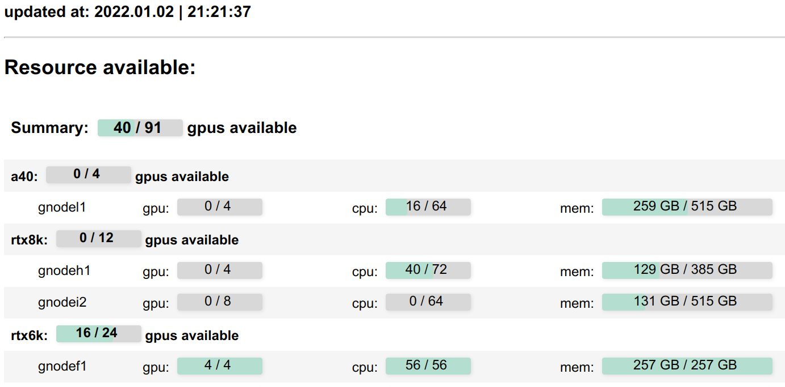

# Slurm Website Monitor
A simple website-based resource monitor for [SLURM](https://slurm.schedmd.com/documentation.html) system.

It parses the results from `sinfo` command every X seconds,
and host the statistics in an internal webpage.
If you are managing CPU/GPU resources with [SLURM](https://slurm.schedmd.com/documentation.html) for your research group, you might find this repository helpful.

This repo is originally developed and maintained for [Visual Geometry Group](https://www.robots.ox.ac.uk/~vgg/), Oxford.

### Screenshot

### News
* [Mar 2023] Monitoring GPU leaderboard by partitions
* [Feb 2023] Update leaderboard: show gpu memory 
* [Aug 2022] Update documentation for command line usage
* [Mar 2022] Support monitoring Disk IO
* [Mar 2022] Support toggling light/dark mode
* [Feb 2022] Update leaderboard: show bash/sbatch jobs
* [Jan 2022] Initial release! Monitor three elements:
  1. GPU nodes (#gpu, #cpu-core, memory)
  2. Leaderboard,
  3. Waiting queue

### Required python packages
Run `pip install -r requirements.txt` to install the dependencies

### Launch Web Monitor
For example, run the command: `python app.py --host localhost --port 8080`.
Then the website will be hosted at `localhost:8080/`. 

You should change the host and port for your server.
Also change the [index.html](index.html) for header/footer and formatting.

### Running as a command-line tool (inherited from [slurm_gpustat](https://github.com/albanie/slurm_gpustat))

* You can also use slurm_gpustat in the command line by `python slurm_web/slurm_gpustat.py`

* or by adding the following alias to your `.bash_profile`: `alias slurm_gpustat='python ~/slurm_web/slurm_gpustat.py'`

### Reference
With some supports from [slurm_gpustat](https://github.com/albanie/slurm_gpustat).
